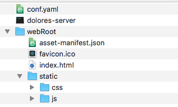

[](https://circleci.com/gh/DoloresTeam/dolores-server/tree/master)

# dolores-server
服务端主要做两件事：

 - 为客户端提供组织架构 REST API
 - 提供一个用于管理组织架构的Web APP

*请确认您已经安装数据库，如未安装[请移步这里](https://github.com/DoloresTeam/dolores-ldap-init)*

### 通过软件包安装

 [Mac](http://oq1inckvi.bkt.clouddn.com/dolores-mac.zip)、 [Linux](http://oq1inckvi.bkt.clouddn.com/dolores-linux.zip)、 [windows](http://oq1inckvi.bkt.clouddn.com/dolores-win.zip)
 
### 从源码编译安装
服务端用`go`语言开发，所以您需要配置`go` 语言开发环境 [传送门](https://golang.org)

**0x00.  获取源码**
``` bash
go get -u https://github.com/DoloresTeam/dolores-server
```
**0x01.  编译**
``` bash
cd dolores-server && go build
```

**0x02.  获取后台管理程序**

 - 直接下载编译后的[压缩包](http://oq1inckvi.bkt.clouddn.com/webRoot.zip)
 - 通过源码自己编译 [传送门](https://github.com/DoloresTeam/dolores-admin)

获取后台管理文件，将其copy至服务端程序同目录的 `webRoot` 子目录

**0x03. 获取配置文件模版**

[配置文件模版下载](http://oq1inckvi.bkt.clouddn.com/conf.yaml)  

获取配置文件以后，将其与服务端程序放在同目录(或者运行服务端程序是使用 `--path` 指定配置文件)

### 配置

1. dolores使用了环信的云服务来处理IM消息，所以您需要先注册去环信注册一个账号获取 `ClientID` 、`Secret`。[点击立即申请](http://docs.easemob.com/im/000quickstart/10register)

2.  dolores 使用七牛存储用户头像等其他文件，所以你需要注册一个七牛账号获取 `AccessKey`、`SecretKey`. [点击立即申请](https://developer.qiniu.com/kodo/manual/1233/console-quickstart)

默认配置文件如下：
``` yaml
#open-ldap
host: 127.0.0.1 # 数据库主机
port: 389 # 数据库端口
subffix: dc=dolores,dc=store # ldap mdb 数据库subffix
rootdn: cn=admin,dc=dolores,dc=store # 注意rootDN的后缀要和上面一致
rootpwd: dolores
#七牛
qnaccesskey: ReplaceMe # 目前用来存储头像
qnsecretkey: ReplaceMe
# 环信
emclientid: ReplaceMe
emsecret: ReplaceMe
embaseurl: https://a1.easemob.com/ReplaceMe #注意这里，后面拼接自己的company org_name app

```

 - open-ldap： 数据库连接信息
 - 七牛：七牛云存储信息
 -  环信：IM消息服务连接信息

配置结束，当前目录类似于这样：

 
### 运行

``` bash
./dolores-server --path conf.yaml
```

好了，如果没有错误消息，那么恭喜你`dolores-server` 配置安装成功。你可以访问`http://localhost:3280`管理组织架构，然后使用[dolores-ios](https://github.com/DoloresTeam/dolores-ios)来测试组织架构更新，聊天等功能。
